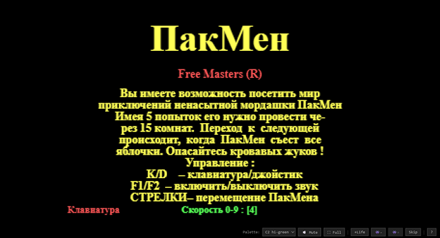
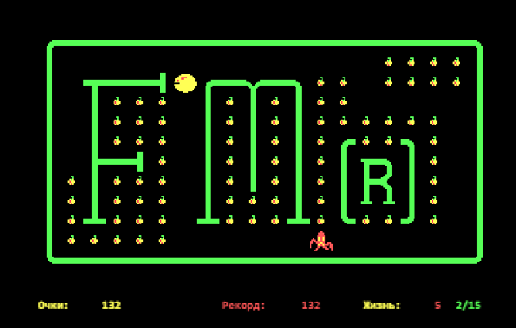

# ПакМен (PacMan 2) — JavaScript Port

A faithful browser port of **PACKMAN.EXE**, a Pac-Man clone made in Kiev, Ukraine in 1990 by **Free Masters**.

I played this game as a kid in the early '90s on a CGA monitor. Decades later, I found the original 42 KB DOS executable and decided to bring it back to life — this time in a browser.

**[Play it now](https://esix.github.io/demo/packman/)** — just open `js/index.html`, no build step needed.





---

## The Story

The original game was written in Turbo C/Pascal for DOS, using Borland's **BGI (Borland Graphics Interface)** library for rendering. It runs in CGA 320x200 mode with 4-color palettes and uses the PC speaker for sound. The binary embeds the string `"CGA Device Driver 2.00 — Mar 21 1988"`, which is the BGI CGA driver.

All text in the game is in Russian (CP866 encoding). The start screen reads:

> Вы имеете возможность посетить мир приключений ненасытной мордашки ПакМен.
> Имея 5 попыток его нужно провести через 15 комнат.
> Опасайтесь кровавых жуков!

Translation: *"You have the opportunity to visit the world of adventures of the insatiable PacMan. With 5 attempts you need to guide him through 15 rooms. Beware of the bloody bugs!"*

The enemies aren't ghosts — they're "кровавые жуки" (bloody bugs), rendered as star-shaped sprites.

---

## Reverse Engineering

The original `PACKMAN.EXE` is a 42 KB MZ DOS executable. To port it faithfully, I disassembled and decompiled it:

1. **[Reko Decompiler](https://github.com/uxmal/reko)** — produced a 6944-line x86 ASM listing (`PACKMAN_0800.asm`) and a decompiled C approximation (`PACKMAN_0800.c`). When the ASM and C disagreed, ASM was treated as ground truth.

2. **Manual binary analysis** — extracted sprite data, level grids, movement patterns, and string tables directly from the EXE using file offset arithmetic (`file_offset = DS_offset + 0x400`).

3. **Node.js extractor** (`tools/extract.js`) — reads the original EXE and generates `src/data.js` containing all 15 level grids, 29 CGA sprites, and palette data.

### Key Findings from the Binary

| Detail | Value |
|--------|-------|
| Screen resolution | 320x200, CGA 4-color |
| Graphics library | BGI (Borland Graphics Interface) |
| Maze grid | 20 columns x 12 rows |
| Tile size | 16x14 pixels |
| Sprite format | 56 bytes each (14 rows x 4 bytes, 2bpp CGA) |
| Total sprites | 29 (walls, dots, Pacman frames, enemy frames) |
| Levels | 15 |
| Starting lives | 5 (`0x23 / 7` via `idiv`) |
| RNG | Linear congruential: `seed = seed * 0x015A4E35 + 1` |
| Movement | Asymmetric: 4px/step horizontal, 2px/step vertical |
| Enemy AI | Chase when aligned, otherwise follow predefined patterns |
| Collision | Always fatal — no power-ups or fright mode |
| Score | +2 per dot eaten |
| Extra lives | At 600, 1200, 2000, 2600 points |
| Speed control | Keys 0-9, stored as inverted value (`0x39 - keycode`) |

### BGI Details

The game was built with Borland's BGI graphics library, which provided:
- **Vector fonts** — the title "ПакМен" uses BGI Gothic font (font #4), menu text uses Triplex font (font #1)
- **`putimage` / `bar` / `outtextxy`** — standard BGI drawing primitives for sprites, rectangles, and text
- **CGA palette switching** — 4 selectable palettes (green, cyan/magenta, bright green, bright cyan)
- **`settextstyle` / `setcolor` / `setfillstyle`** — BGI state machine for rendering attributes

The BGI CGA driver renders into CGA video memory at segment B800h with interleaved even/odd scanlines, but the game's own sprite data uses a simple linear 2bpp layout (4 pixels per byte).

---

## Architecture

```
 index.html       Entry point (no build step)
 tools/
 └── extract.js   extracts 15 levels, 29 sprites, fixes level 13, writes `data.js`
 src/
 ├── data.js      Generated: 15 levels, 29 sprites, palettes
 ├── input.js     Keyboard state tracker
 ├── sound.js     Web Audio API PC-speaker emulation
 ├── renderer.js  Canvas 2D renderer (2bpp sprite decode)
 └── game.js      Game logic (state machine, AI, collision)
```

Five plain JavaScript files loaded in order by `index.html`. No frameworks, no bundler, no dependencies.

---

## Controls

| Key | Action |
|-----|--------|
| Arrow keys | Move Pacman |
| Space / Enter | Start game |
| 0–9 | Speed (0 = slowest, 9 = fastest) |
| F1 / F2 | Sound off / on |
| ESC | Return to menu |
| S / L (menu) | Save / Load game |

The browser version also supports WASD for movement and adds a palette selector and cheat buttons in the UI.

---

## CGA Palettes

The game supports 4 CGA color palettes, selectable from the UI:

| Palette | Color 0 | Color 1 | Color 2 | Color 3 |
|---------|---------|---------|---------|---------|
| C0 (low) | Black | Green | Red | Brown |
| C1 (low) | Black | Cyan | Magenta | White |
| C2 (high) | Black | Bright Green | Bright Red | Yellow |
| C3 (high) | Black | Bright Cyan | Bright Magenta | White |

Default is C2 (bright green) — the palette I remember from childhood.

---

## Credits

- **Original game**: PACKMAN by **Free Masters**, Kiev, Ukraine, 1990
- **Decompilation**: [Reko Decompiler](https://github.com/uxmal/reko) by Uxmal

---

## License

This port is a clean-room reimplementation based on reverse engineering of the original binary for educational and 
preservation purposes.
